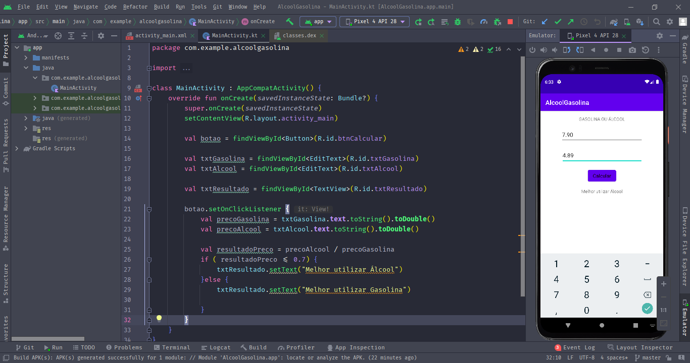

<h1 align="center">
Álcool ou Gasolina
</h1>

Projeto disciplinar.

## Participantes

[Luciano Ribeiro](https://github.com/lucianorbr)

## Tecnologias

- [x] Kotlin

## O Projeto
- App Android para calculo se compensa abastecer com álcool ou gasolina

  

